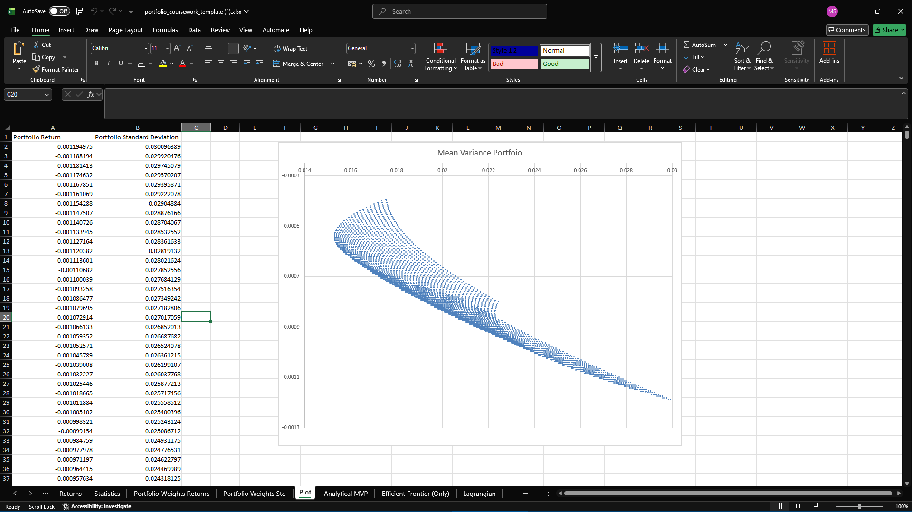

# Stock Portfolio Analysis

## Overview
This project applies portfolio theory and statistical modelling to analyse the risk-return characteristics of a three-asset portfolio consisting of Microsoft (MSFT), Oracle (ORCL), and Sony (SONY).

The analysis focuses on understanding return behaviour, quantifying risk, and evaluating the benefits of diversification. In addition, a lognormal model is used to simulate stock price paths and assess its effectiveness compared to real market data.

---

## Tools & Techniques
- Excel (financial modelling, simulation, optimisation)
- Log return calculations
- Descriptive statistics (mean, variance, standard deviation)
- Covariance and correlation analysis
- Portfolio optimisation (efficient frontier, minimum variance portfolio)
- Lognormal price simulation

---

## Methodology

### 1. Data Preparation
- Daily stock prices collected for MSFT, ORCL, and SONY  
- Logarithmic returns calculated using:  
  ln(Pₜ) − ln(Pₜ₋₁)

### 2. Statistical Analysis
- Computed mean returns, variance, and standard deviation  
- Analysed covariance and correlation between assets  
- Assessed risk and return characteristics of each stock  

### 3. Portfolio Construction
- Generated multiple portfolio combinations  
- Constructed the efficient frontier  
- Identified inefficient portfolios  
- Determined the minimum variance portfolio and corresponding asset weights  

### 4. Simulation (Lognormal Model)
- Simulated stock price paths using normally distributed log returns  
- Compared simulated results with real market data  
- Analysed distribution properties including skewness and kurtosis  

---
## Visualisation

## Key Results

- Minimum variance portfolio identified with approximate weights:  
  - MSFT: 30%  
  - ORCL: 4%  
  - SONY: 66%  

- Oracle exhibited the highest volatility, indicating greater risk  
- Microsoft showed the most stable return profile  
- Sony contributed diversification due to weaker correlation with other assets  

- Portfolio diversification reduced overall risk compared to individual stocks  

- The lognormal model failed to capture:
  - Extreme market movements (fat tails)  
  - Volatility clustering  
  - Sudden price jumps driven by real-world events  

---

## Key Insights

- Diversification significantly improves the risk-return trade-off  
- Real financial data does not follow strict normality assumptions  
- Models based on constant volatility and normal distributions underestimate real-world risk  
- External economic events and market sentiment play a major role in price dynamics  

---

## Files

### Analysis
- [Portfolio Optimisation Analysis](analysis/portfolio_optimisation_analysis.xlsx)  
- [Lognormal Model Simulation](analysis/lognormal_model_simulation.xlsx)  

### Reports
- [Portfolio Analysis Report](reports/portfolio_analysis_report.pdf)  
- [Lognormal Model Report](reports/lognormal_model_report.pdf)  

---

## Summary
This project demonstrates the application of financial theory and statistical techniques to real market data. It highlights the importance of diversification, the limitations of standard financial models, and the need for more advanced approaches when modelling real-world asset behaviour.
